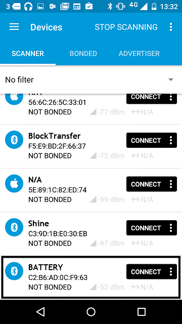
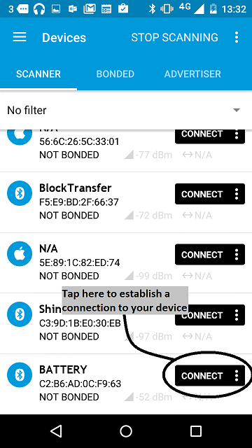
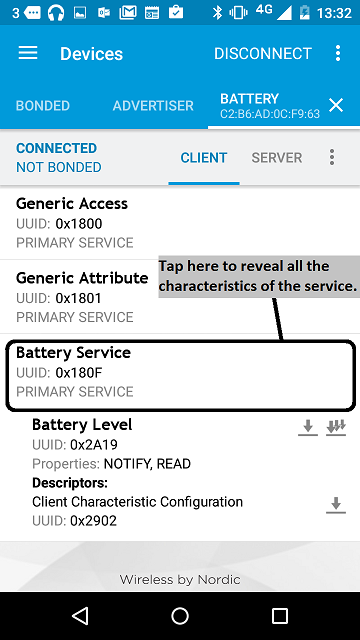
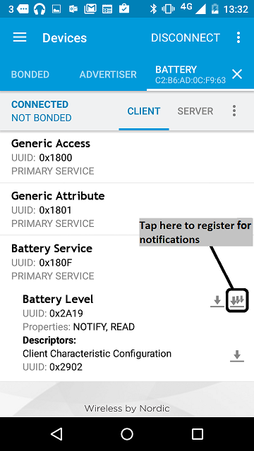
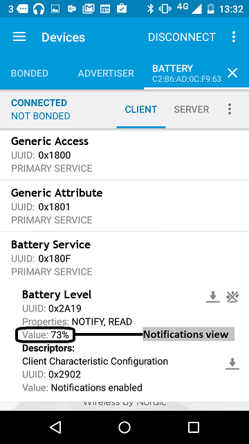

This example creates and updates a standard Battery Level service containing a single
GATT characteristic.

The [battery service transmits](https://developer.bluetooth.org/gatt/services/Pages/ServiceViewer.aspx?u=org.bluetooth.service.battery_service.xml) a device's battery level in percentage, with 100% being a fully charged battery and 0% being a fully drained battery.

Although the sample application runs on a BLE device, it doesn't show the device's real battery level (because that changes very slowly and will make for a dull example). Instead, it transmits a fake battery level that starts at 50% (half charged). Every half second, it increments the battery level, going in single increments until reaching 100% (as if the battery is charging). It then drops down to 20% to start incrementing again.

# Running the application

## Requirements

The sample application can be seen on any BLE scanner on a smartphone. If you don't have a scanner on your phone, please install :

- [nRF Master Control Panel](https://play.google.com/store/apps/details?id=no.nordicsemi.android.mcp) for Android.

- [LightBlue](https://itunes.apple.com/gb/app/lightblue-bluetooth-low-energy/id557428110?mt=8) for iPhone.

Hardware requirements are in the [main readme](https://github.com/ARMmbed/ble-examples/blob/master/README.md).

## Building instructions

Building instructions for all samples are in the [main readme](https://github.com/ARMmbed/ble-examples/blob/master/README.md).

## Checking for success

**Note:** Screens captures depicted below show what is expected from this example if the scanner used is *nRF Master Control Panel* version 4.0.5. If you encounter any difficulties consider trying another scanner or another version of nRF Master Control Panel. Alternative scanners may require reference to their manuals.

1. Build the application and install it on your board as explained in the building instructions.
1. Open the BLE scanner on your phone.
1. Start a scan.

    

    **figure 1** How to start scan using nRF Master Control Panel 4.0.5

1. Find your device; it should be named `BATTERY`.

    

    **figure 2** Scan results using nRF Master Control Panel 4.0.5

1. Establish a connection with your device.

    

    **figure 3**  How to establish a connection using Master Control Panel 4.0.5

1. Discover the services and the characteristics on the device. The *Battery service* has the UUID 0x180F and includes the *Battery level* characteristic which has the UUID 0x2A19.

    

    **figure 4** Representation of the Battery service using Master Control Panel 4.0.5

1. Register for the notifications sent by the *Battery level* characteristic.

    

    **figure 5** How to register to notifications using Master Control Panel 4.0.5

1. You should see the battery level value change every half second. It begins at 50, goes up to 100 (in steps of 1), resets to 20 and so on.

    

    **figure 6** Notifications view using Master Control Panel 4.0.5

If you can see the characteristic, and if its value is incrementing correctly, the application is working properly.

