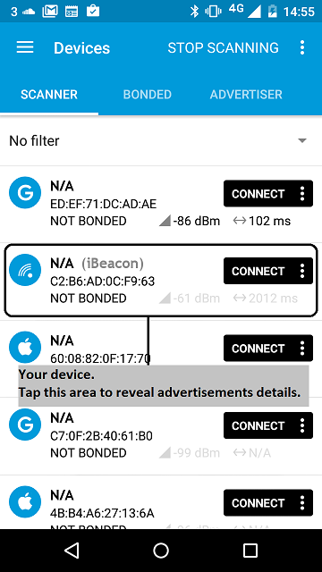
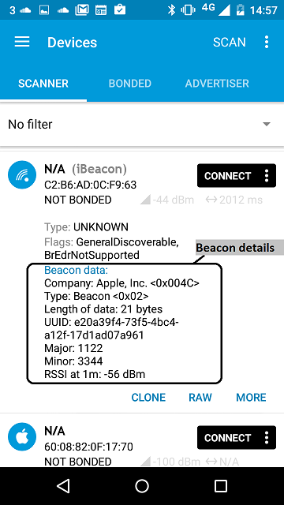

This example creates a BLE beacon: a method of advertising a small amount of information to nearby devices. The information doesn't have to be human-readable; it can be in a format that only an application can use.

Beacons are very easy to set up: the code for all beacons is the same, and only the information you want to advertise - the beacon payload - needs to change.

This example advertises a UUID, a major and minor number and the transmission strength. The major and minor numbers are an example of information that is not (normally) meaningful to humans, but that an application can use to identify the beacon and display related information. For example, if the major number is a store ID and the minor number is a location in that store, then a matching application can use these numbers to query a database and display location-specific information.

# Running the application

## Requirements

The sample application can be seen on any BLE scanner on a smartphone. If you don't have a scanner on your phone, please install :

- [nRF Master Control Panel](https://play.google.com/store/apps/details?id=no.nordicsemi.android.mcp) for Android.

- [LightBlue](https://itunes.apple.com/gb/app/lightblue-bluetooth-low-energy/id557428110?mt=8) for iPhone.

Hardware requirements are in the [main readme](https://github.com/ARMmbed/ble-examples/blob/master/README.md).

## Building instructions

Building instructions for all samples are in the [main readme](https://github.com/ARMmbed/ble-examples/blob/master/README.md).

## Checking for success

**Note:** Screens captures depicted below show what is expected from this example if the scanner used is *nRF Master Control Panel* version 4.0.5. If you encounter any difficulties consider trying another scanner or another version of nRF Master Control Panel. Alternative scanners may require reference to their manuals.

1. Build the application and install it on your board as explained in the building instructions.
1. Open the BLE scanner on your phone.
1. Start a scan.

    

    **figure 1** How to start scan using nRF Master Control Panel 4.0.5

1. Find your device; it should be tagged as an `iBeacon` and observe its advertisements (there is no need to connect to the beacon).

    

    **figure 2** Scan results using nRF Master Control Panel 4.0.5

1. View the beacon's details; the exact steps depend on which scanner you're using.

    

    **figure 3** Beacon details using nRF Master Control Panel 4.0.5

**Tip:** If you are in an area with many BLE devices, it may be difficult to identify your beacon. The simplest solution is to turn your board off and on, initiate a new scan on your BLE scanner every time, and look for the beacon that appears only when your board is on.

If you can see the beacon and all its information, the application worked properly.

For more information, see the [mbed Classic version of this application](https://developer.mbed.org/teams/Bluetooth-Low-Energy/code/BLE_iBeacon/).
